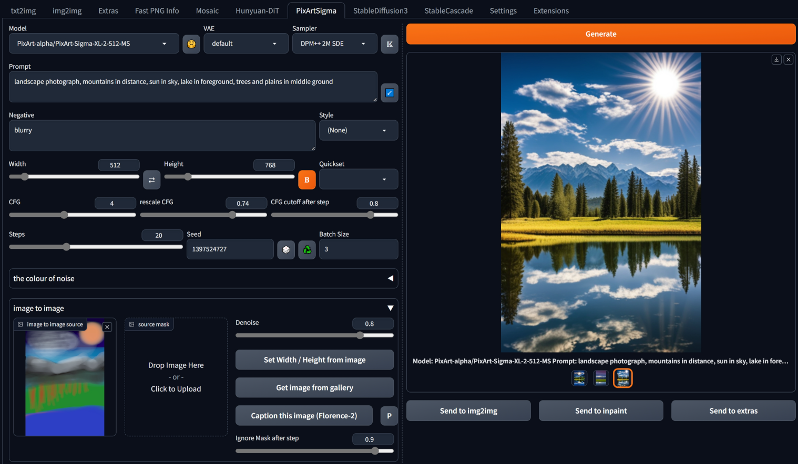

## PixArt Sigma (and Alpha) for webui ##
### Forge tested, probably A1111 too ###
I don't think there is anything Forge specific here.
### works for me <sup>TM</sup> on 8Gb VRAM, 16Gb RAM (GTX1070) ###

---
## Install ##
Go to the **Extensions** tab, then **Install from URL**, use the URL for this repository.
### needs updated *diffusers*, *transformers*, *tokenizers*, and *peft* ###

Easiest way to ensure necessary versions are installed is to edit **requirements.txt** or **requirements_versions.txt** in the webUI folder.
```
diffusers>=0.28.1
tokenizers>=0.19
transformers==4.40
peft
```
These upgrades didn't break anything for me.

---
### downloads models on demand - minimum will be ~20Gb ###

---
### screenshot ###
current UI




---
At your own risk. This is ~~barely~~ ~~moderately~~ somewhat tested, ~~and even then~~ but only on my computer.
Models will be downloaded automatically, on demand (so if you never generate with the 256 model, it'll never be downloaded). The T5 text encoder is around 18Gb and the image models are about 2.3Gb each.
The models include the float32 T5 model, which I convert to fp16 on first use and save the result for all future runs. This conversion and saving is automatic. Once done, the full size float32 model could be deleted to reclaim some space.

Note that Alpha and Sigma both use the same T5 text encoder, my caching system means it should only be downloaded once regardless for how many models are used.

I can generate using all models, though the 2K Sigma model is very slow on my limited hardware. It's undertrained anyway, at present.

---
####15/07/2024 ####
* added quickset for image dimensions, options update for different models

#### 14/07/2024 ####
Many changes, hopefully not many bugs too:
* made my own pipeline, combining Alpha and Sigma pipelines and enabling the following additions
* added rescaleCFG
* added CFG cutoff (disable CFG after some number of steps - faster processing, impact on image quality depends on cutoff point but can be minimal)
* added mask for image to image

#### 12/07/2024 ####
* couple of bugfixes, thanks to @BlipOnNobodysRadar for reports.

#### 10/07/2024 ####
* improved yesterday's effort. More compatibility, multi-line, etc.

#### 09/07/2024 ####
* some code cleanups
* added prompt parsing to automatically fill in details like seed, steps, etc.

#### 03/07/2024 ####
* tweaked Florence-2: model now runs on GPU so is faster.

#### 30/06/2024 ####
* added huggingface emoji button to toggle sending of huggingface access token. Some repos may be gated, requiring acceptance of terms before use and an access token. Downloading/updating these models is not possible without these steps, but already downloaded models will continue to work ~~(current example: ptx0/pixart-900m-1024-ft)~~. The official models are not gated.
	* Sign up / log in, go to your profile, create an access token. Copy it. Make a textfile called ```huggingface_access_token.txt``` in the main webui folder, i.e. ```{forge install directory}\webui```, and paste the token in there. (same instructions as for SD3, only needs done once).

#### 25/06/2024 ####
* added option to caption using Florence-2, in image to image section. 'P' button toggles overwriting prompt, results always written to console.
* minor code improvements

#### 17/06/2024 ####
* tweaked logic for model identification. Added new finetune, seems likely to continue to be updated, *ptx0/pixart-900m-1024-ft* to models list. [Info](https://huggingface.co/ptx0/pixart-900m-1024-ft)

#### 16/06/2024 ####
* settings to colourize the initial noise. This is essentially free extra control. Leave strength at 0.0 to bypass it. Doesn't seem as effective with PixArt as with other models, but still something to experiment with.

#### 09/06/2024 ####
* added **modelsListPA.py** in extension directory - edit in any text editor to hide models you don't care about or add new models (must be huggingface diffusers style checkpoints)
* added button to toggle resolution binning, enabled by default and generally best left enabled IMO. I was testing disabling it for potential hires fix type uses, with some limited success around x1.5 upscale. x2 was messy. Maybe repeated smaller upscales could work, but probably better to send to img2img and use an sdXL checkpoint to upscale.

#### 07/06/2024 ####
* added [flash diffusion](https://huggingface.co/jasperai/flash-pixart). This is a distilled Lora (211MB) on top of Alpha1024: 4 steps, low CFG (1-2), seems much better than LCM. Forced LCM scheduler. Needs **peft** library.

#### 05/06/2024 ####
* small update to work with diffusers >= 0.28.1 : Transformer2DModel is now PixArtTransformer2DModel

#### 27/05/2024 ####
* override sampler for LCM and DMD in right place, a bit earlier than before
* added saving of DMD step in infotext when using DMD model; also don't save CFG and step count for DMD (would be redundant)

#### 25/05/2024 ####
avoid error message when Set Width/Height from Image without an image loaded

### 07/05/2024 ###
* various tweaks. The K button enables karras sigmas for schedulers/samplers, which could be worth experimenting with.
* img2img

### 04/05/2024 ###
* UI reshuffle. again
* made using OpenAI consistency decoder VAE optional (previously DMD always used it, and other Alpha models never did, Sigma models can't) - it's VRAM greedy (for me only usable on 512 models) and not always better.

### 03/04/2024
* added SA-solver, DPM SDE
* forced default sampler for LCM, DMD models
* forced empty negative, 1 step, 1 CFG for DMD
* cache VAE to share between models. Sharing is default behaviour for PixArt-Sigma, but the Alpha models each had their own copy. Now it'll only be downloaded the first time.
* added LCM, DMD
	* ~~note: DMD doesn't install correctly - repository is missing *tokenizer* directory. Seems like the symlinks (follow the Snapshot folder) can simply be copied from another Alpha model.~~ This shouldn't be an issue anymore, as I always fetch tokenizer from the same place rather than from each model.
* simple optimisation: if prompts not changed, text_encoder stage is skipped
* styles, ~~really should be in own file for easy editing~~

### 02/05/2024 ###
* support for PixArt-Alpha models - they use the same T5 text encoder.
* fixed ~~(but still commented out)~~ saving of fp16 text encoder. Previously might not have saved in the right place.

### 01/05/2024 ###
* samplers
* captions in gallery (where linebreaks?)
* correct seeds for batches

### to do ###


---
prompt: portrait photograph, woman with red hair, wearing green blazer over yellow tshirt and blue trousers, on sunny beach with dark clouds on horizon


---
Thanks to:
* [frutiemax92](https://github.com/frutiemax92) for inference_pipeline.py
* [benjamin-bertram](https://github.com/benjamin-bertram/sdweb-easy-stablecascade-diffusers) for ui details
