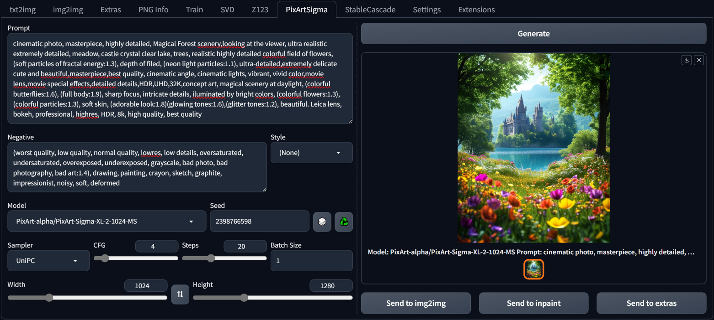

## PixArt Sigma (and Alpha) for webui ##
### Forge tested, probably A1111 too ###
I don't think there is anything Forge specific here.
### works for me (tm) on 8Gb VRAM, 16Gb RAM (GTX1070) ###

---
### screenshot ###
[source of word spam prompt](https://civitai.com/images/11438825)




---
### downloads models on demand - minimum will be ~20Gb ###
### needs updated *diffusers* ###
be sure you are updating the right one, in Forge:
```
*forge directory*\system\python\Lib\site-packages
```
```
pip install --upgrade -t .\ git+https://github.com/huggingface/diffusers
```
You should end up with v0.28.0 (as of 30/04/2024).
There is code for earlier versions of diffusers, but it didn't work with the 2K model and needed updating for 256 and 1024 (at least for me).

### Alpha needs updated *transformers* and *tokenizers* ###
Easiest way to achieve this is to edit **requirements.text** and **requirements_versions.txt** in the webUI folder. Otherwise starting the webUI will undo the tokenizers upgrade.
```
tokenizers>=0.19
transformers==4.40
```
These upgrades didn't break anything for me.

---
At your own risk. This is ~~barely~~ moderately tested, ~~and even then~~ but only on my computer.
Models will be downloaded automatically, on demand (so if you never generate with the 256 model, it'll never be downloaded). The T5 text encoder is around 18Gb and the image models are about 2.3Gb each.
I preferentially load a fp16 version of the T5 model. Fall back is to the full model which is converted to fp16 when used. This conversion and saving is automatic. Once done, the full size float32 models could be deleted to reclaim some space.

Note that Alpha and Sigma both use the same T5 text encoder model, my caching system means it should only be downloaded once.

I can generate using all models, though the 2K model does hit shared memory a lot, so is significantly slower.

---
### added 01/05/2024 ###
* samplers
* captions in gallery (where linebreaks?)
* correct seeds for batches

### added 02/05/2024 ###
* support for PixArt-Alpha models - they use the same T5 text encoder.
* fixed ~~(but still commented out)~~ saving of fp16 text encoder. Previously might not have saved in the right place.

### added 03/04/2024
* added SA-solver, DPM SDE
* forced default sampler for LCM, DMD models
* forced empty negative, 1 step, 1 CFG for DMD
* cache VAE to share between models. Sharing is default behaviour for PixArt-Sigma, but the Alpha models each had their own copy. Now it'll only be downloaded the first time.
* added LCM, DMD
	* note: DMD doesn't install correctly - repository is missing *tokenizer* directory. Seems like the symlinks (follow the Snapshot folder) can simply be copied from another Alpha model.
* simple optimisation: if prompts not changed, text_encoder stage is skipped
* styles, really should be in own file for easy editing

### to do ###

test some timestep sequences - but which samplers support custom timesteps?


---
prompt: portrait photograph, woman with red hair, wearing green blazer over yellow tshirt and blue trousers, on sunny beach with dark clouds on horizon


---
Thanks to:
* [frutiemax92](https://github.com/frutiemax92) for inference_pipeline.py
* [benjamin-bertram](https://github.com/benjamin-bertram/sdweb-easy-stablecascade-diffusers) for ui details
 
